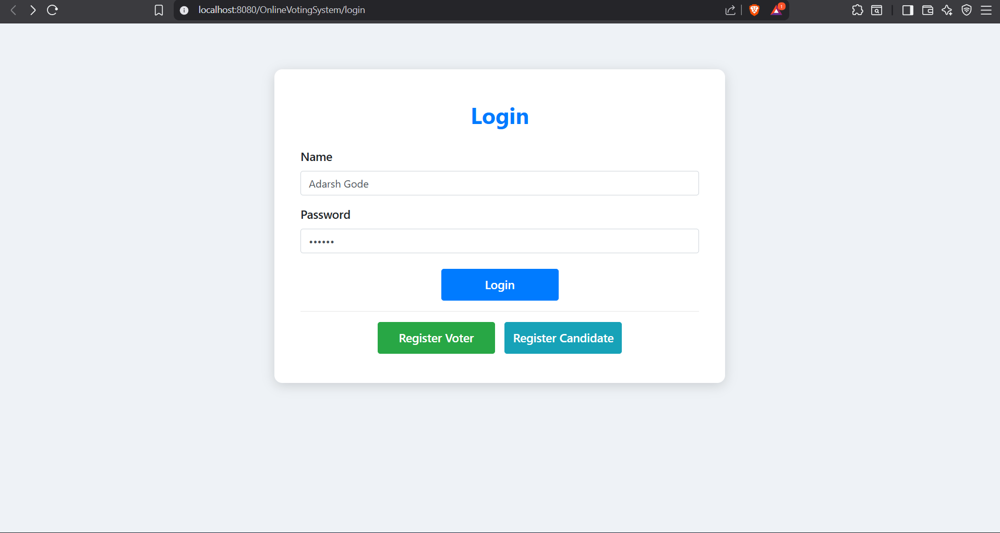
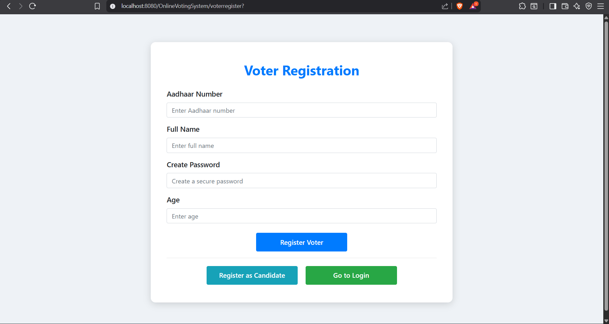
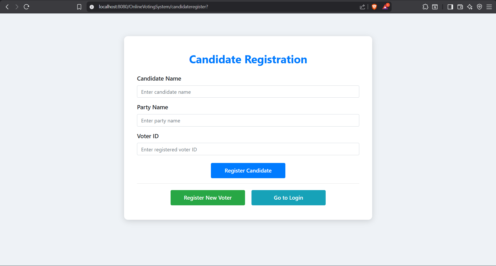
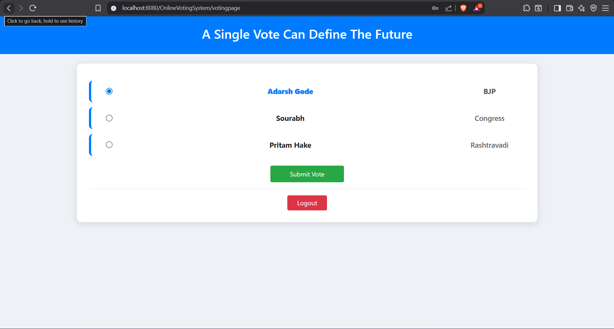
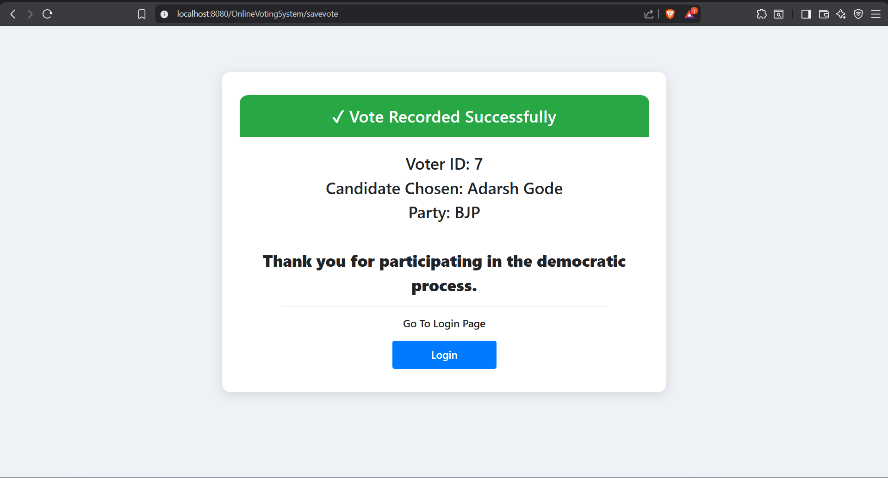
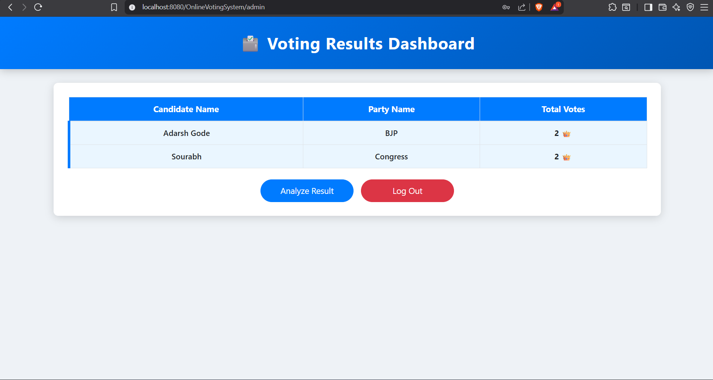
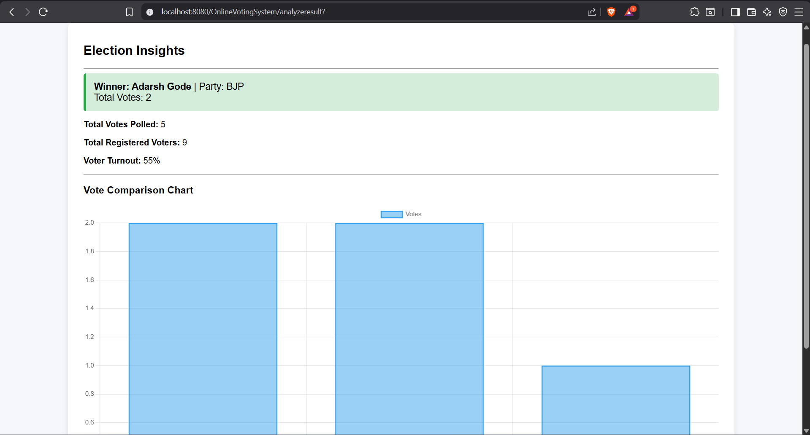
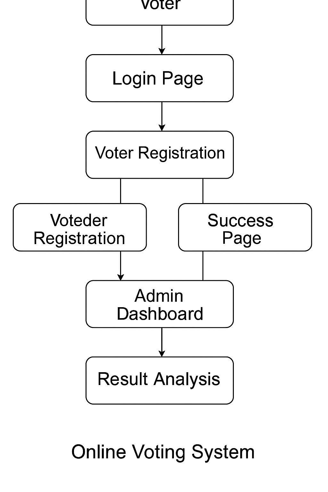

# 🗳️ Online Voting System

The **Online Voting System** is a secure web-based election platform developed using **Java, JSP, Servlets, JDBC, MySQL, and Bootstrap**.  
It enables user registration, candidate enrollment, voting, vote counting, and result analysis through a clean and interactive UI.

---

## 🚀 Features

### 👤 Voter Side
- Voter Registration & Login
- Secure Vote Casting (only once)
- Logout with session handling
- Success receipt after voting

### 🏛️ Admin Side
- View total votes per candidate
- Analyze election results with:
  - Winner highlight
  - Vote comparison bar chart
  - Voter turnout metrics
- Download analytics if required (extendable)

### 🔐 Security
- Session-based authentication
- Vote status check (prevents re-voting)
- Servlet + Filter based authorization

---

## 📸 Screenshots

> Store images in `/screenshots/` directory and update paths below.

### 🟦 Login Page


### 🟢 Voter Registration


### 🟠 Candidate Registration


### 🗳️ Voting Page


### ✔️ Vote Recorded Successfully


### 📊 Admin Dashboard


### 📈 Result Analysis & Charts


## 🗂️ System Flow Overview


---

## 🏗️ Tech Stack

| Layer | Technology |
|-------|------------|
| Frontend | JSP, HTML, CSS, Bootstrap |
| Backend | Java Servlets |
| Database | MySQL |
| Connectivity | JDBC |
| Server | Apache Tomcat 8.5 |
| Tools | Eclipse / IntelliJ, GitHub |

---

## 📊 Election Analytics

- **Total Votes Polled**
- **Total Registered Voters**
- **Voter Turnout %**
- **Winner + Vote Count**
- **Chart.js Vote Comparison Graph**

---

## ⚙️ Setup & Installation

1. Clone Repository
```bash
git clone https://github.com/yourusername/OnlineVotingSystem.git
